# GameHub

GameHub offers a diverse collection of engaging games and interactive experiences. From classic games like Pac-Man and Tetris to fun puzzles and quizzes, explore a wide range of entertainment options. Enjoy rolling dice, testing memory, and challenging your skills with various exciting games all in one app.

## Screenshots

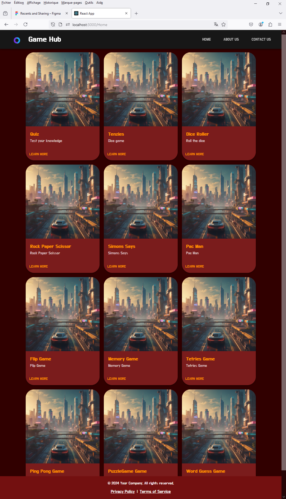
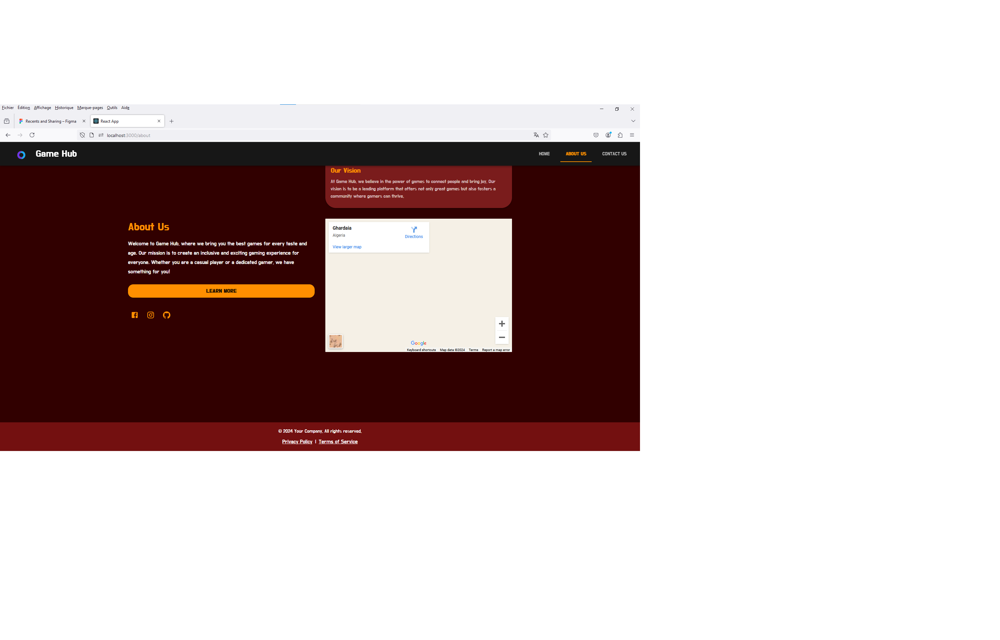
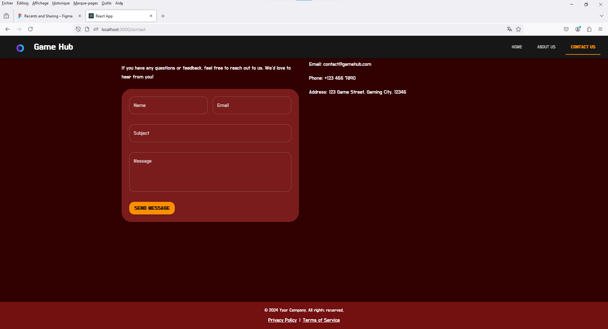
*Home screen with a list of all available games.*

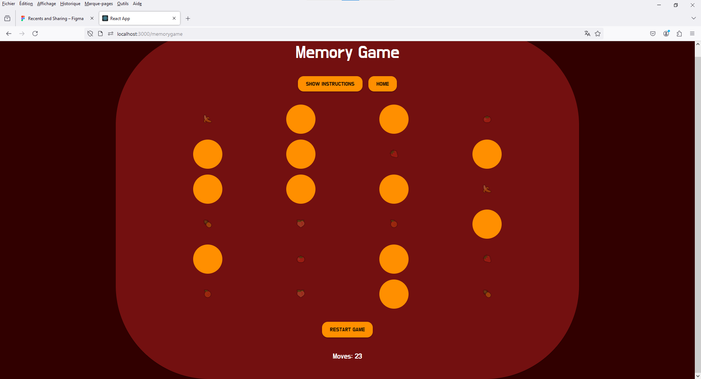
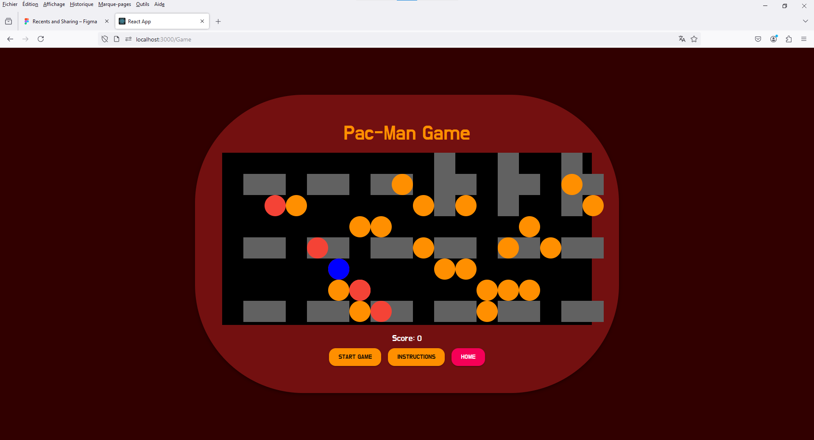
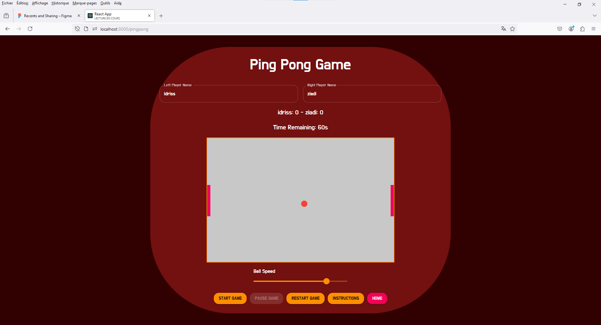
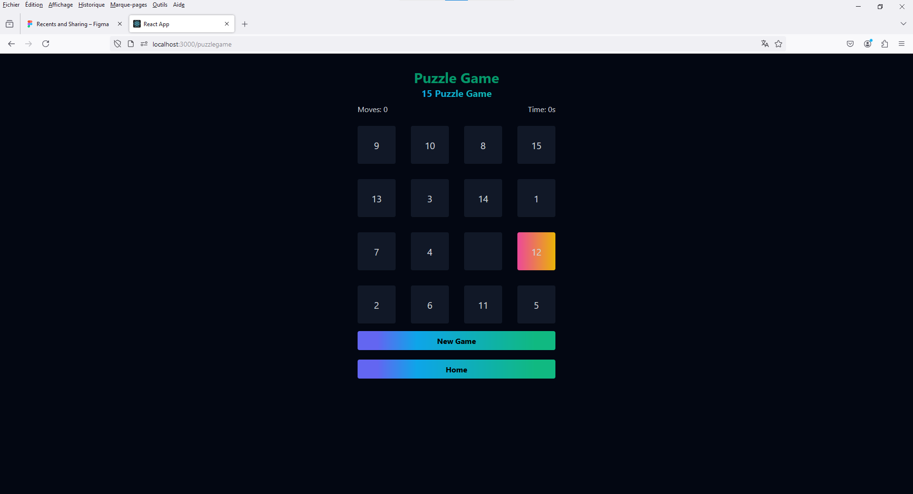
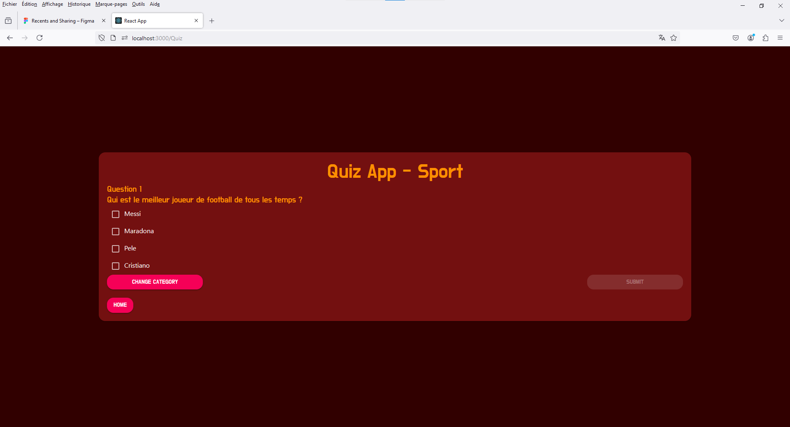
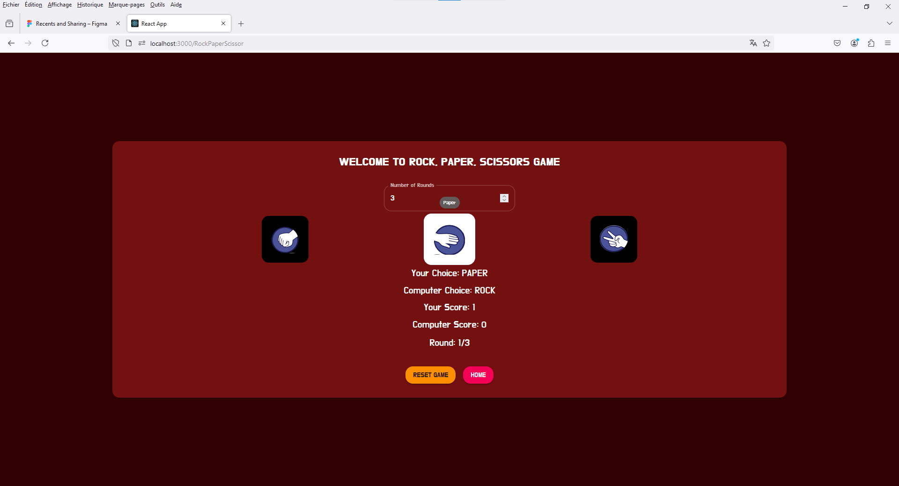
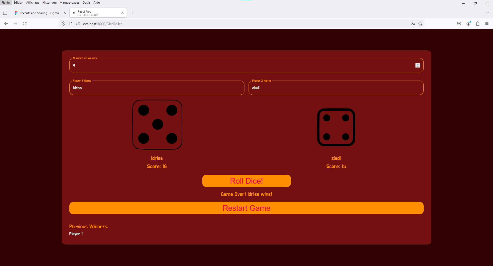
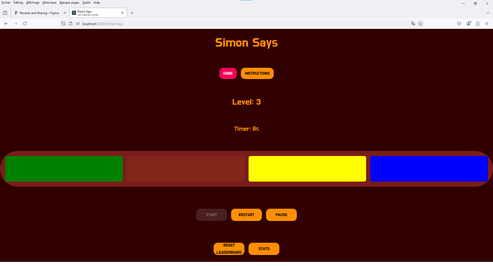
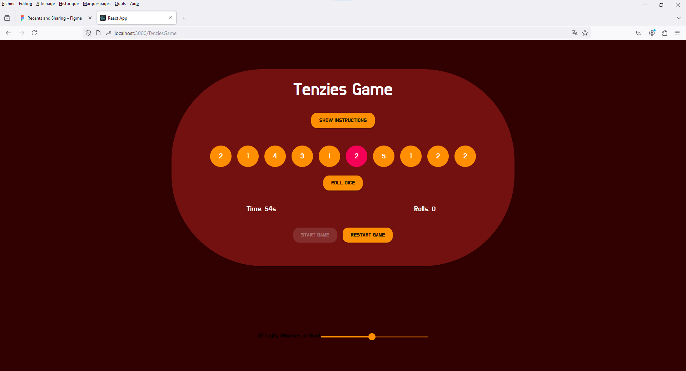
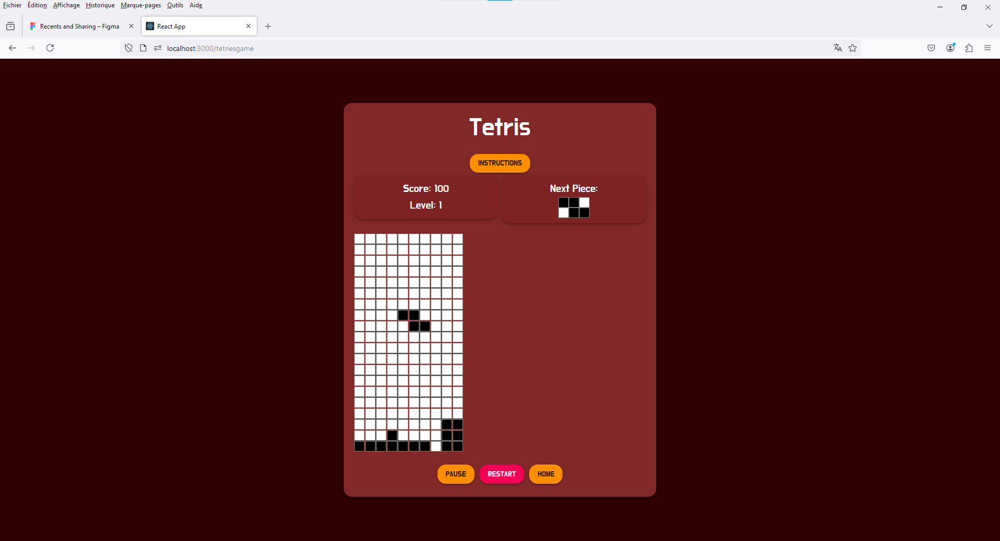
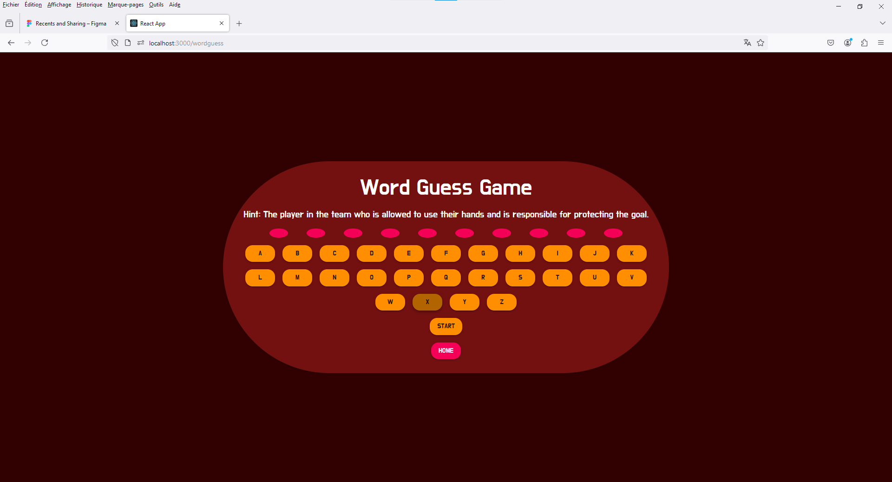
*Playing a classic game like Pac-Man.*

## Features

- Diverse collection of classic and modern games.
- Interactive puzzles and quizzes.
- Memory challenges and dice rolling.
- Regular updates with new games and experiences.

## Installation

To run this project locally, follow these steps:

1. Clone the repository:
    ```bash
    git clone [https://github.com/idrissziadi/gamehub.git](https://github.com/idrissziadi/Game-Hub.git)
    cd gamehub
    ```

2. Install dependencies:
    ```bash
    npm install
    ```

3. Start the development server:
    ```bash
    npm start
    ```

Your app will be running at `http://localhost:3000`.

## Usage

Open the application and explore the game categories. Select a game to start playing. Use your mouse or keyboard controls depending on the game.

## Contributing

Contributions are welcome! Please fork the repository and submit a pull request with your changes. Ensure your code follows the existing style and includes relevant tests.

## License

This project is licensed under the MIT License - see the [LICENSE](LICENSE) file for details.

## Contact

For any questions or feedback, feel free to reach out:
- Email: idriss.ziadi47@gmail.com
- GitHub: [idrissziadi](https://github.com/idrissziadi)

## Technologies Used

- React
- JavaScript (ES6+)
- HTML/CSS
- Material UI
